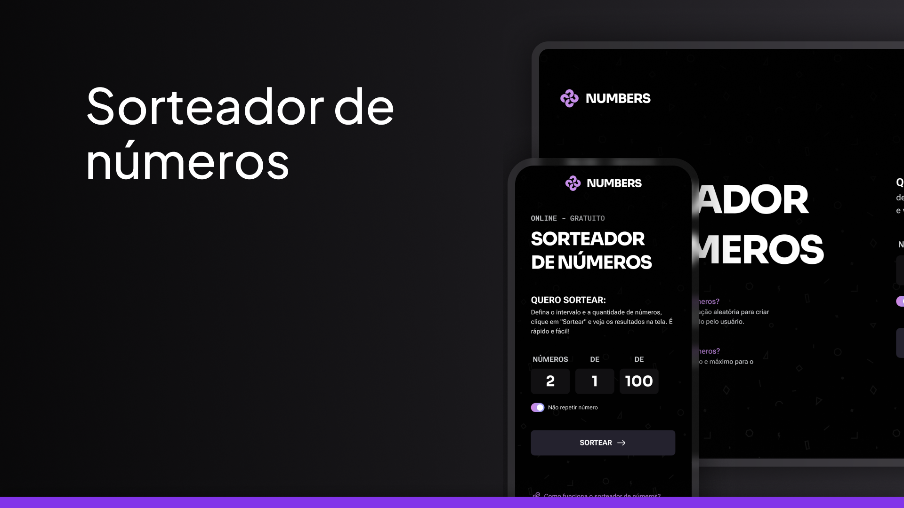

<h1 align="center"> Sorteador de Números </h1>

  

## 🚀 Tecnologias

Esse projeto foi desenvolvido com as seguintes tecnologias:

- HTML e CSS
- JavaScript
- Git e Github

## 💻 Projeto

Aplicação web para sortear números aleatórios dentro de um intervalo definido pelo usuário, com ou sem repetição.

## :memo: Licença

Esse projeto está sob a licença MIT.
